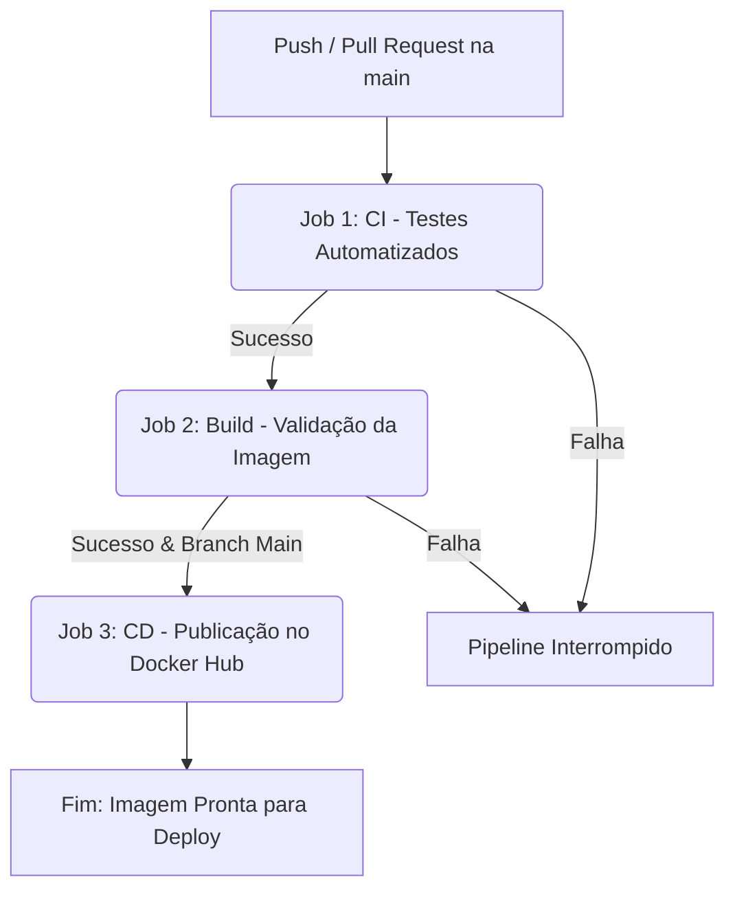

# Implementação de Pipeline CI/CD com Docker 🚀
**Curso:** Análise e Desenvolvimento de Sistemas (ADS)  
**Disciplina:** Gerenciamento de Configuração de Software  
**Professor:** Adriano França  

---

## 👥 Equipe
* Rildo Cesar
* Caio Pedrosa
* David Henrique
* Lucas Cunha
* Rubens

---

## 📝 Sobre o Projeto
Este projeto consiste no desenvolvimento de uma API REST funcional containerizada utilizando práticas modernas de DevOps. O ecossistema conta com testes automatizados integrados a uma esteira de automação completa (pipeline) via **GitHub Actions**, realizando a validação, build e entrega contínua diretamente no **Docker Hub**.

A API foi construída em **Python** utilizando o framework **FastAPI**, gerenciando um recurso completo de **Tarefas (To-Do List)** com persistência de dados simulada em memória.

---

## 🛠️ Arquitetura do Pipeline CI/CD
O fluxo de automação foi desenhado em três estágios estritamente encadeados e sequenciais:



---

## 🚀 Tecnologias Utilizadas

* **Python 3.11** - Linguagem de programação.
* **FastAPI** - Framework web moderno e veloz.
* **Pytest** - Ferramenta para testes automatizados.
* **Docker** - Criação e isolamento de ambientes.
* **GitHub Actions** - Automação da esteira CI/CD.

---

## ⚙️ Configuração do Ambiente Local

### Pré-requisitos
* Git instalado.
* Docker instalado e executando.

### 1. Clonar o Repositório
```bash
git clone https://github.com
cd seu-repositorio
```

### 2. Rodar com Docker (Modo Prático)
Para subir a aplicação localmente sem precisar instalar o Python na sua máquina:
```bash
# Construir a imagem Docker
docker build -t api-todo .

# Iniciar o container na porta 8000
docker run -d -p 8000:8000 --name api-container api-todo
```
Acesse a API em: `http://localhost:8000`  
Acesse a documentação interativa em: `http://localhost:8000/docs`

---

## 🛣️ Rotas da API (Endpoints)

| Método | Endpoint | Descrição |
| :--- | :--- | :--- |
| **GET** | `/tasks` | Lista todas as tarefas |
| **GET** | `/tasks/{id}` | Busca uma tarefa por ID |
| **POST** | `/tasks` | Cria uma nova tarefa |
| **PUT** | `/tasks/{id}` | Atualiza uma tarefa existente |
| **DELETE** | `/tasks/{id}` | Remove uma tarefa do sistema |

---

## 🛡️ Detalhes dos Jobs da Esteira (CI/CD)

1. **Job 1: CI (Continuous Integration)**
   * Sobe um ambiente virtual temporário com Python.
   * Instala as dependências do projeto.
   * Executa a suíte de testes com o `pytest`.

2. **Job 2: Build**
   * Valida se o arquivo `Dockerfile` está estruturado corretamente.
   * Realiza o build de teste da imagem para garantir que não há erros de compilação.

3. **Job 3: CD (Continuous Delivery)**
   * Disparado apenas após o sucesso dos jobs anteriores e na branch `main`.
   * Realiza a autenticação segura no Docker Hub usando segredos (`secrets`).
   * Adiciona tags (ex: `latest`) e publica a imagem final no repositório remoto.

---

## 👥 Contribuição e Desenvolvimento

Para rodar os testes localmente e garantir que seu código passará na esteira do GitHub Actions:

```bash
# Criar ambiente virtual
python -m venv venv
source venv/bin/activate  # No Windows use: venv\Scripts\activate

# Instalar dependências de desenvolvimento
pip install -r requirements.txt

# Executar testes
pytest
```
